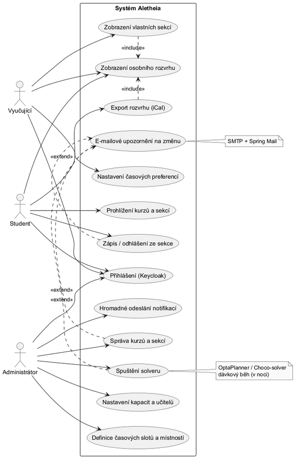
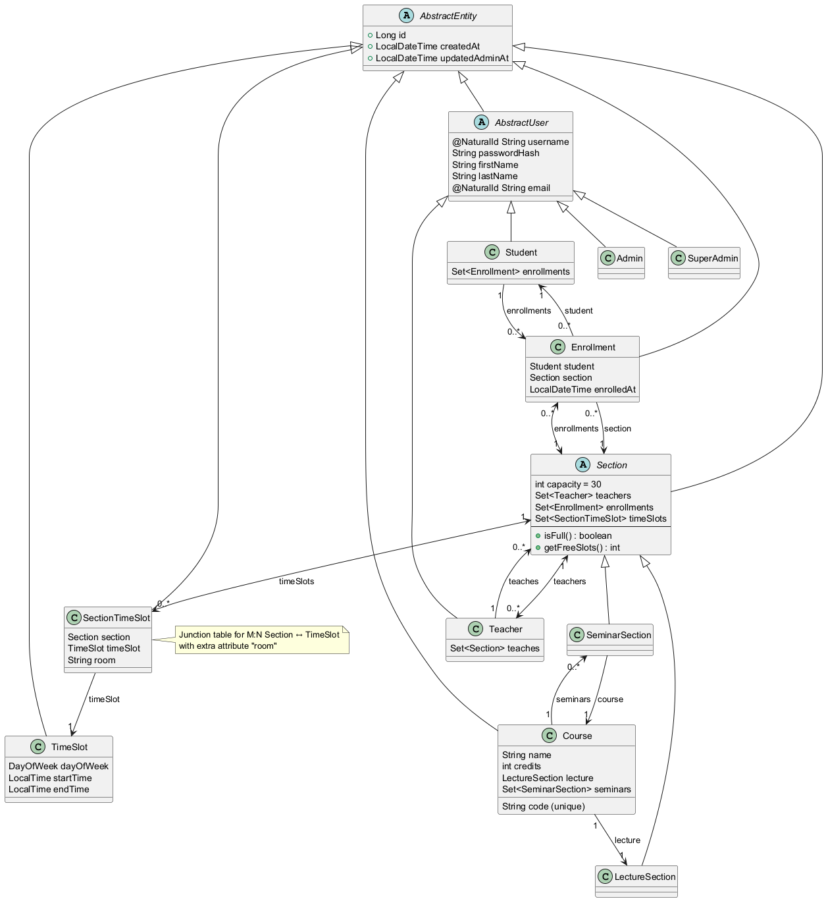
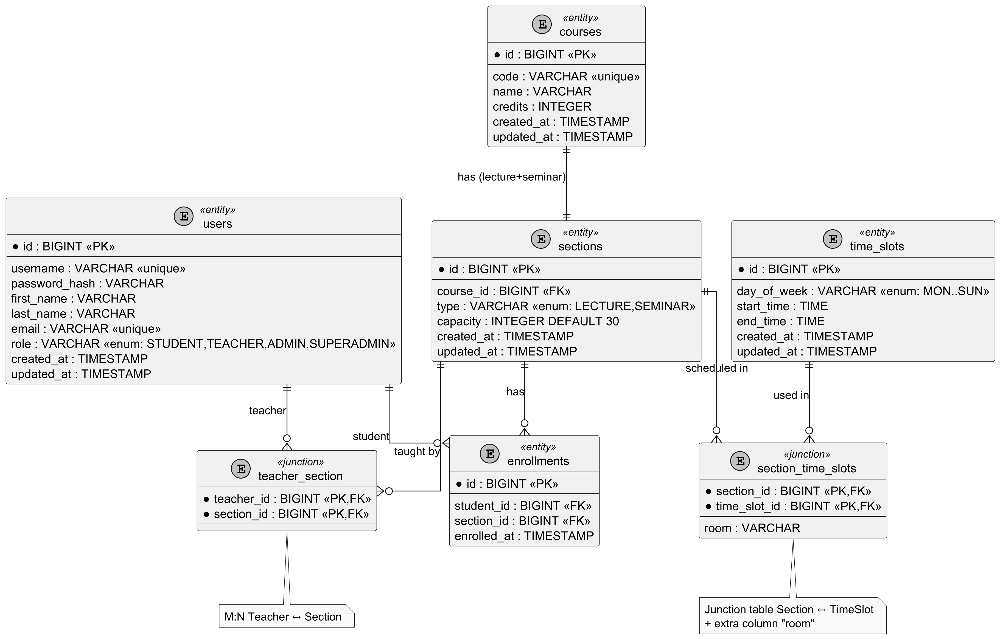

# Předmět: B6B36EAR – Enterprise architektury

### Specifikace softwarových požadavků (Software Requirements Specification – SRS)

#### Projekt: Aletheia – systém pro rozvrhování univerzitních kurzů

**Fakulta:** FEL ČVUT v Praze

**Vedoucí projektu:** Ing. Martin Řimnáč, Ph.D.

**Student:** Vladimir Zubkov

**Datum:** 9. listopadu 2025

**Verze:** 0.95

---

### 1. Úvod

#### 1.1 Účel (Purpose)

Cílem projektu Aletheia je vytvořit webovou aplikaci, která automaticky vytváří, spravuje a zobrazuje rozvrhy univerzitních kurzů.
Systém pomáhá rozvrhářům plánovat rozvrh, učitelům i studentům definovat své preference a poskytuje přehled o časech, místnostech a změnách bez nutnosti ručního plánování.

#### 1.2 Konvence dokumentu (Document Conventions)

CRUD – Create, Read, Update, Delete
DB – Databáze
UI – Uživatelské rozhraní
API – Aplikační programové rozhraní
SMTP – Simple Mail Transfer Protocol

#### 1.3 Cílové publikum (Intended Audience)

Tento projekt vzniká jako semestrální práce v rámci předmětu. Je určen:

* rozvrhářům – kteří tvoří a upravují rozvrhy,
* vyučujícím – kteří zadávají své časové preference,
* studentům – kteří se zapisují do kurzů.

#### 1.4 Rozsah projektu (Project Scope)

Aletheia poskytuje online prostředí pro:

* plánování kurzů, sekcí a místností,
* správu zápisů studentů,
* automatické vyhodnocení kolizí a preferencí,
* informování uživatelů o změnách e-mailem,
* optimalizaci rozvrhu pomocí solveru.

Cílem je jednoduché, přehledné a spolehlivé rozhraní, které nahradí ruční tvorbu rozvrhů nebo tabulky v Excelu.

#### 1.5 Reference

* Semestrální práce V. Zubkov – *University Timetabling (Scheduling) Problem*
* IEEE Std 830-1998 – *Software Requirements Specification Standard*
* Krazytech: *Sample SRS – Airline Database System (2025)*

---

### 2. Celkový popis systému (Overall Description)

#### 2.1 Postavení produktu (Product Perspective)

Aletheia je webová aplikace s architekturou client–server.
Na straně serveru běží Java Spring Boot aplikace s databází PostgreSQL, na straně klienta webové rozhraní (např. React nebo Thymeleaf).
Systém využívá role uživatelů: administrátor, vyučující a student.

#### 2.2 Funkce produktu (Product Features)

* CRUD operace nad kurzy, sekcemi, časovými sloty a místnostmi
* Zadávání preferencí učitelů a studentů
* Automatická kontrola kolizí a kapacit
* Optimalizace rozvrhu pomocí solveru
* E-mailové notifikace o změnách
* Export rozvrhu do iCal
* Statistiky využití místností

#### 2.3 Typy uživatelů (User Classes and Characteristics)

| Role                     | Popis                                    | Technická úroveň |
| ------------------------ | ---------------------------------------- | ---------------- |
| Administrátor (Rozvrhář) | Tvoří a spravuje rozvrhy, spouští solver | Pokročilá        |
| Vyučující (Teacher)      | Zadává preference, sleduje své kurzy     | Střední          |
| Student                  | Zapisuje se do sekcí a sleduje rozvrh    | Základní         |

#### 2.4 Provozní prostředí (Operating Environment)

Server: Java 21, Spring Boot 3+, PostgreSQL 16
Klient: Chrome, Firefox, Edge
Nasazení: Docker, volitelně Kubernetes

#### 2.5 Omezení návrhu (Design and Implementation Constraints)

* Použití Spring Boot frameworku
* REST API propojuje frontend a backend
* Optimalizace pomocí OptaPlanner nebo Choco-solver
* Notifikace přes Spring Mail
* Maximálně 10 000 studentů a 2 000 sekcí

#### 2.6 Předpoklady a závislosti (Assumptions and Dependencies)

* SMTP server je dostupný z univerzitní sítě
* Solver se spouští dávkově (např. v noci)
* Všichni uživatelé mají univerzitní účet

---

### 3. Funkční požadavky (Functional Requirements – FRQ)

#### 3.1 Správa rozvrhu (Administrator)

frq-A-01 – Přidávání, úprava a mazání kurzů a jejich sekcí
frq-A-02 – Nastavení kapacit sekcí a přiřazení učitelů
frq-A-03 – Definice časových slotů a přiřazení místností
frq-A-04 – Spuštění optimalizačního solveru a zobrazení výsledků
frq-A-05 – Odesílání notifikací o změnách rozvrhu učitelům a studentům

#### 3.2 Funkce vyučujících (Teacher)

frq-T-01 – Nastavení časových preferencí (dostupnost, oblíbené časy)
frq-T-02 – Zobrazení vlastních sekcí a studentů v nich
frq-T-03 – Upozornění e-mailem při změně času nebo místnosti

#### 3.3 Funkce studentů (Student)

frq-S-01 – Zobrazení všech kurzů a sekcí s kapacitou
frq-S-02 – Zápis a odhlášení ze sekce bez kolizí
frq-S-03 – Zobrazení a export osobního rozvrhu (např. do iCal)

---

### 4. Nefunkční požadavky (Non-Functional Requirements – NFRQ)

#### 4.1 Kvalita a pravidla rozvrhu

nfrq-Q-01 – Žádný učitel nebo student nesmí mít kolidující sekce (hard constraint)
nfrq-Q-02 – Kapacita sekcí nesmí být překročena (hard constraint)
nfrq-Q-03 – Respektování preferencí učitelů a studentů (soft constraint)
nfrq-Q-04 – Solver minimalizuje kolize a přesuny (soft constraint)

#### 4.2 Výkon a provoz solveru

nfrq-P-01 – Solver dokončí výpočet do 10 minut pro 1000 sekcí
nfrq-P-02 – Solver běží dávkově (např. v noci) a ukládá nejlepší řešení

#### 4.3 Spolehlivost a bezpečnost

nfrq-SC-01 – Přihlášení přes univerzitní účet nebo Keycloak
nfrq-SC-02 – Data chráněna HTTPS a hashováním hesel (BCrypt)

#### 4.4 Použitelnost a rozšiřitelnost

nfrq-U-01 – Webové rozhraní je přehledné, responzivní a v češtině
nfrq-U-02 – Systém lze snadno rozšířit pro další fakulty nebo univerzity

---

### 5. Externí rozhraní (External Interface Requirements)

#### 5.1 Uživatelské rozhraní (User Interface)

Jednoduché webové prostředí:

* Dashboard s přehledem kurzů a sekcí
* Kalendářový pohled rozvrhu (FullCalendar.js)
* Barevné rozlišení předmětů a stavů (volno/plno/kolize)

#### 5.2 Hardwarové rozhraní (Hardware Interfaces)

Není potřeba žádný speciální hardware – systém běží v běžném univerzitním prostředí.

#### 5.3 Softwarové rozhraní (Software Interfaces)

* PostgreSQL 16
* JavaMail API
* OptaPlanner nebo Choco Solver
* REST API mezi frontendem a backendem

#### 5.4 Komunikační rozhraní (Communication Interfaces)

* HTTPS pro bezpečnou komunikaci
* SMTP pro e-maily

---

### 6. Dodatečné informace (Supporting Information)

#### 6.1 Diagram případů užití (Use-Case Diagram)

#### 6.2 Diagram tříd (Class Diagram)

#### 6.3 Diagram datových entit (ERD)

#### 6.4 Datový slovník (Data Dictionary)
Course – kurz  
Section – konkrétní výuka (přednáška, cvičení)  
TimeSlot – časový blok  
Enrollment – zápis studenta  

#### 6.5 Slovníček pojmů (Glossary)
Hard constraint – pravidlo, které musí být splněno  
Soft constraint – pravidlo, které zlepšuje řešení, ale není povinné